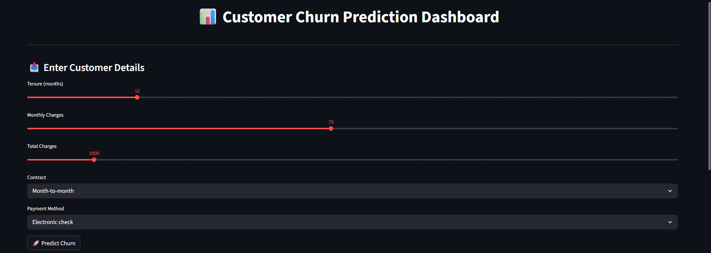
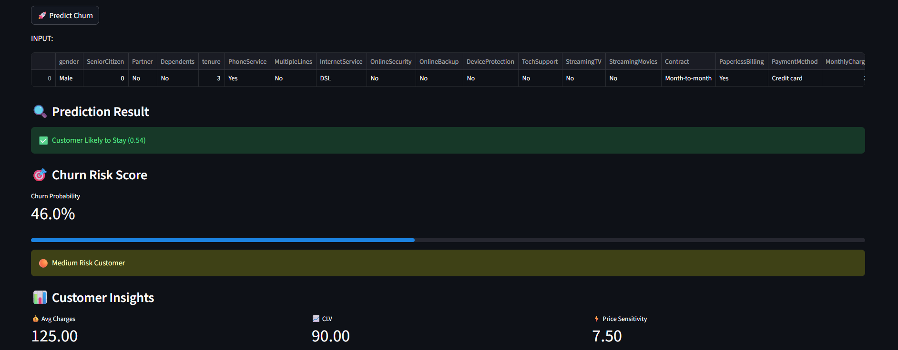
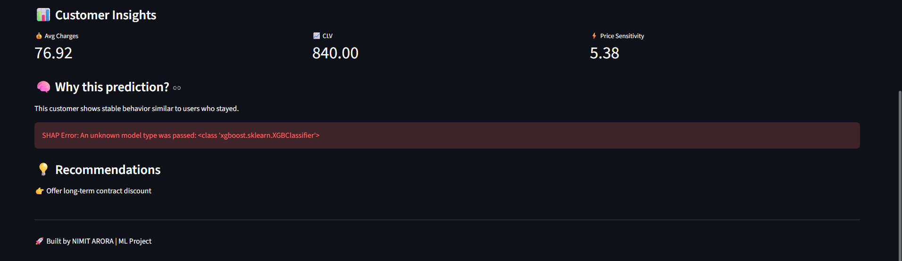

# 🚀 Customer Churn Prediction Dashboard

An end-to-end **Machine Learning project** that predicts customer churn and provides **actionable business insights** through an interactive dashboard.

---

## 📌 Project Overview

This project builds a churn prediction system using **Scikit-learn pipelines** and deploys it using **Streamlit Cloud**.

The model uses **XGBoost with class imbalance handling** to improve churn detection, especially for high-risk customers.

The application allows users to:

* 🔍 Predict whether a customer will churn
* 📊 View churn probability score
* 📈 Analyze customer insights (CLV, price sensitivity)
* 🧠 Understand key drivers behind predictions
* 💡 Get business recommendations

---

## ❗ Problem Statement

Customer churn is a major issue in the telecom industry.

* Acquiring a new customer costs **5× more** than retaining an existing one
* Businesses need **data-driven strategies** to reduce churn

**Goal:**

* Predict churn probability
* Identify key factors
* Provide actionable insights

---

## 🛠️ Tech Stack

* **Python**
* **Pandas, NumPy** → Data processing
* **Scikit-learn** → Model & pipeline
* **SHAP** → Explainability
* **Streamlit** → UI
* **Joblib** → Model saving
* **Git & GitHub** → Version control
* **Streamlit Cloud** → Deployment

---

## 🤖 Model Performance

| Metric            | Value |
| ----------------- |-------|
| Accuracy          | 75%   |
| Precision (Churn) | 0.54  |"
| Recall (Churn)    | 0.72  |
| F1 Score          | 0.62  |

**Interpretation:**

* Model prioritizes **high recall (0.72)** to capture most churn-prone customers  
* Slight trade-off in accuracy is acceptable for business use  
* Better suited for **customer retention strategies**

## 🔍 Model Explainability (SHAP)

To make predictions interpretable, SHAP (SHapley Additive exPlanations) is used to identify the key factors influencing each prediction.

### What it shows:

- Contribution of each feature to churn prediction  
- Top drivers behind customer risk  
- Positive and negative impact of features  

### Example Insights:

- High MonthlyCharges → increases churn risk  
- Low tenure → strong indicator of churn  
- Lack of TechSupport → increases probability of churn  

This helps transform the model from a **black box** into an **explainable system**, enabling better business decisions.

---

## 📸 Application Screenshots

### 🖥️ Dashboard



### 📊 Prediction Output



### 📈 Insights & Recommendations



---

## 🌐 Live Demo

👉 **Try the app:**
https://churn-prediction-scarlet.streamlit.app/

---

## 📊 Key Features

* 🎯 Real-time churn prediction
* 📉 Risk scoring system
* 📊 Customer insights (CLV, pricing sensitivity)
* 🔍 Explainable AI using SHAP (feature-level insights)
* 💡 Smart recommendations
* ⚡ Optimized model with high churn recall (77%)

---

## 🧠 Business Insights

### 🔴 Short Tenure = High Risk

Customers with low tenure are more likely to churn.

### 🟡 High Monthly Charges Increase Risk

High-paying customers are more price-sensitive.

### 🟢 Long-Term Customers Are Stable

Higher total charges → long-term retention → lower churn risk.

---

## 💡 Business Recommendations

### ✅ Promote Long-Term Contracts

Encourage users to switch to yearly plans with discounts.

### ✅ Target At-Risk Customers

Offer personalized discounts and retention campaigns.

### ✅ Improve Onboarding Experience

Focus on first 3–6 months with better support and engagement.

---

## 🖥️ Run Locally

**Prerequisites:** Python 3.10+ and Git installed

**1. Clone the repository**
```bash
git clone https://github.com/scarletnexus1/churn-prediction.git
cd churn-prediction
```

**2. Create a virtual environment**
```bash
python -m venv venv
source venv/bin/activate        # On Windows: venv\Scripts\activate
```

**3. Install dependencies**
```bash
pip install -r requirements.txt
```

**4. Run the app**
```bash
streamlit run app.py
```

**5. Open in browser**

## 🧠 Key Learning

The biggest challenge in ML projects is not model building, but:

* Maintaining consistent data schema
* Handling deployment issues
* Ensuring reproducibility

---

## 👨‍💻 Author

**Nimit Arora**

---

## ⭐ Support

If you found this useful:

* ⭐ Star the repository
* Share feedback
* Connect for collaboration

---
